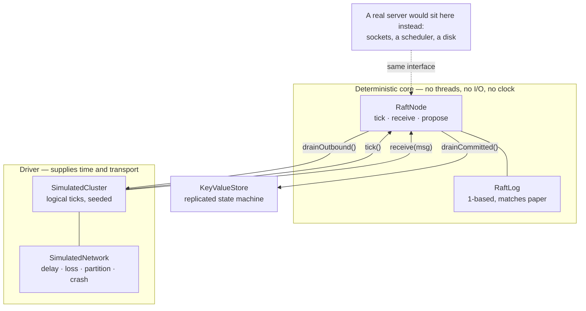

# Raft KV

[](https://github.com/Ankitnehra6/raft-kv/actions/workflows/ci.yml)
[](https://openjdk.org)
[](LICENSE)

An implementation of the [Raft consensus algorithm](https://raft.github.io/raft.pdf) and a
key-value store built on it — written from the start to be **deterministically
simulation-tested**.

A five-node cluster runs single-threaded inside a unit test. Partitions, packet loss,
message reordering and crashes are all inputs. There is not one `Thread.sleep` in the
suite, and **95 tests run in 0.4 seconds** — including nine seeds each driving 500 ticks of
split-brain checking, and **linearizability verified** over histories recorded under
partitions, packet loss and leader crashes.

> **Status:** consensus core, simulation harness, leader election, log replication, the
> replicated store and linearizability checking are done and tested. Persistence,
> snapshotting, membership changes and a gRPC surface are not yet built — see
> [Roadmap](#roadmap). This README does not claim otherwise.

---

## Contents

- [Why simulation testing](#why-simulation-testing)
- [Architecture](#architecture)
- [Quickstart](#quickstart)
- [Linearizability](#linearizability)
- [What is verified](#what-is-verified)
- [Design decisions](#design-decisions)
- [Roadmap](#roadmap)

---

## Why simulation testing

Consensus bugs are almost never logic errors you can see by reading. They are bugs of
timing and ordering: a vote arriving after a term change, a response from a leadership
that has already ended, two nodes briefly both believing they lead. Those interleavings
happen rarely on a real network and essentially never on demand.

So the algorithm here has no threads, no sockets, no files and no wall clock.
[`RaftNode`](src/main/java/io/github/ankitnehra6/raftkv/core/RaftNode.java) accepts inputs
— `tick()`, `receive(message)`, `propose(command)` — mutates its state, and queues outputs
for a driver to collect. Everything that moves bytes lives outside it.

That buys three things a conventional test suite cannot have:

1. **Reproducibility.** A run is a pure function of its seed. "Fails about one time in
   fifty" becomes a fixed input someone can step through.
2. **Speed.** An hour of cluster behaviour costs a millisecond, so hostile scenarios can be
   run across many seeds on every commit rather than nightly.
3. **Faults on demand.** A partition is a method call, not an iptables rule.

```java
SimulatedCluster cluster = new SimulatedCluster(5, seed);
cluster.setDropRate(0.2);           // lose a fifth of all messages
cluster.setDelay(1, 6);             // variable delay, so messages reorder
cluster.tickUntilLeaderElected(500);

cluster.partition(List.of("n0", "n1"), List.of("n2", "n3", "n4"));
cluster.tick(300);
assertThat(cluster.node("n0").isLeader()).isFalse();   // a minority cannot lead
```

This is how FoundationDB and TigerBeetle test their consensus layers, and it is the reason
this implementation was written in this order: **the harness came before the algorithm.**

---

## Architecture



The dashed edge is the point: a real server is another driver. The algorithm cannot tell
the difference, which is why testing it against the simulated one is meaningful.

---

## Quickstart

```bash
./mvnw test
```

No Docker, no services, no configuration. 95 tests, well under a second.

```java
// Three nodes, seed 42
SimulatedCluster cluster = new SimulatedCluster(3, 42);
cluster.tickUntilLeaderElected(200);

RaftNode leader = cluster.leader().orElseThrow();
leader.propose(Command.encode(new Command.Put("city", "bengaluru")));
cluster.tick(50);

// Every replica now holds it
cluster.nodes().forEach(n ->
    assertThat(n.log().lastIndex()).isEqualTo(leader.log().lastIndex()));
```

---

## Linearizability

Asserting on logs and terms checks that the implementation matches the paper. It does not
answer the question a *user* has: could a client ever observe something a correct store
would not produce?

So the test driver records only what clients see — request sent, answer received, as an
interval — and a checker searches for a sequential ordering that explains every result
while respecting real-time order.

```
seed    3: total= 51 completed= 37 reads= 20 pending= 14 -> LINEARIZABLE
seed   17: total= 33 completed= 33 reads= 16 pending=  0 -> LINEARIZABLE
seed   42: total= 48 completed= 39 reads= 21 pending=  9 -> LINEARIZABLE
seed  128: total= 45 completed= 37 reads= 18 pending=  8 -> LINEARIZABLE
seed  999: total= 51 completed= 37 reads= 14 pending= 14 -> LINEARIZABLE
```

Those runs each survive twenty-five rounds of partitions, leader kills and 5% packet loss.

**Reads go through the log.** Serving a read from the leader's local state is faster and
wrong: a leader deposed without knowing it would answer from a stale state machine, and a
client would see a value that had already been overwritten. ReadIndex and leases are the
standard optimisations — both are refinements of this, and neither is worth adding before
a correct version exists to compare against.

**The checker is itself tested.** A checker that always answers "linearizable" would make
every other test pass while proving nothing, so five tests assert that it *rejects*
histories which are genuinely impossible:

| Impossible history | Test |
|---|---|
| A read returns a value nothing ever wrote | `rejectsAValueThatWasNeverWritten` |
| A read after a completed write sees the old value | `rejectsAStaleReadAfterACompletedWrite` |
| Two sequential reads go backwards in time | `rejectsReadsThatGoBackwardsInTime` |
| A deleted key is still readable | `rejectsAReadOfADeletedKey` |
| Two clients disagree about a settled value | `rejectsTwoClientsDisagreeingAboutASettledValue` |

Three details that make it sound rather than merely convenient:

- **Exceeding the search budget reports `UNKNOWN`, never success.** A checker that gives up
  and says "fine" converts an unproven claim into a false one.
- **Pending operations are kept.** A write whose response was lost may still have been
  applied, so the checker must be free to place it anywhere — or nowhere. Dropping them
  would produce false violations.
- **The tests refuse to pass vacuously.** `assertMeaningful` fails the run if it produced
  too few operations or too few completed reads, because reads are where a stale answer
  would show up.

---

## What is verified

Every item below is an assertion in the suite, not a description of intent.

### Election safety

| Property | Test |
|---|---|
| At most one leader per term, checked on **every tick** across 9 seeds | `neverTwoLeadersInTheSameTerm` |
| A minority partition can never elect a leader | `aMinorityPartitionCannotElectALeader` |
| The majority side elects one and makes progress | `theMajoritySideElectsALeaderDuringAPartition` |
| An isolated leader steps down when the partition heals | `anIsolatedLeaderStepsDownWhenThePartitionHeals` |
| A stable cluster does not churn through terms | `aLeaderKeepsLeadershipWhileHeartbeatsFlow` |
| Elections converge with 20% packet loss | `electsALeaderDespiteMessageLoss` |
| Elections converge with reordered messages | `electsALeaderDespiteReorderedMessages` |
| The same seed produces byte-identical history | `runsAreReproducible` |

### Log safety

| Property | Test |
|---|---|
| A minority leader cannot commit anything | `aMinorityLeaderCannotCommit` |
| A deposed leader's uncommitted write is **overwritten**, not merged | `aDivergentSuffixIsOverwrittenByTheNewLeader` |
| Logs agree at every committed index after arbitrary chaos, 5 seeds | `logsConvergeAfterHealing` |
| Every node applies the same sequence in the same order | `everyNodeAppliesTheSameSequence` |
| A rejoining follower catches up in a few round trips, not one per entry | `aRejoiningFollowerCatchesUp` |
| Replicas converge after repeated leader crashes, 5 seeds | `replicasConvergeAfterLeaderCrashes` |

---

## Design decisions

**The core is a pure state machine.** Discussed above; it is the decision every other one
follows from.

**Time is logical, not wall-clock.** `RaftConfig` is expressed in ticks. A tick is one
simulation step or a few real milliseconds — the algorithm neither knows nor cares. The
config constructor *rejects* a heartbeat interval at or above the minimum election timeout,
because that misconfiguration produces a cluster that re-elects forever and is miserable to
diagnose from the outside.

**Each node gets its own random stream**, derived from the cluster seed. Sharing one
generator would make a node's election timeout depend on how many draws its peers happened
to make first, so adding a node would perturb everyone's timing and no scenario would stay
reproducible across changes.

**A new leader appends a no-op** in its own term. §5.4.2 of the paper: a leader may not
commit an entry from an earlier term by counting replicas, because such an entry can still
be overwritten. Committing one entry of its own term commits the backlog by implication.

**`matchIndex` comes from the response**, not from what the leader sent. A reordered or
duplicated reply would otherwise advance it to the wrong place.

**Conflicts return a hint.** On a failed consistency check the follower names the first
index of the conflicting term, so the leader skips a whole divergent run in one round trip
instead of walking back one index per round trip. `aRejoiningFollowerCatchesUp` asserts the
difference.

**`appendFrom` truncates only on an actual conflict.** A delayed or duplicated
`AppendEntries` legitimately carries entries the follower already has; truncating blindly
would discard entries it has already acknowledged.

**`SimulatedCluster.leader()` returns empty when there are several.** During a partition
two nodes can both believe they lead, and returning one arbitrarily would hide exactly the
situation worth noticing.

---

## Roadmap

Built:

- [x] Deterministic simulation harness — logical clock, seeded network, partitions, loss,
      reordering, crashes
- [x] Leader election with randomised timeouts and the §5.4.1 up-to-date restriction
- [x] Log replication, commit advancement, conflict hints
- [x] Replicated key-value state machine with length-prefixed command encoding
- [x] **Linearizability checking** — Wing & Gong search, partitioned per key, memoised,
      budget-bounded; and the checker is itself tested against impossible histories
- [x] Linearizable reads, routed through the log
- [x] 95 tests across election safety, log safety, convergence and linearizability

Next, in order:

- [ ] **Durable log** — memory-mapped `FileChannel` with proven `fsync` boundaries, and
      crash recovery tested by restarting a node mid-write
- [ ] **Snapshotting and log compaction** — the log cannot grow forever
- [ ] **Membership changes** — single-server add/remove
- [ ] **gRPC surface** — a real client API and a real network driver, which the pure core
      is already shaped to accept
- [ ] Follower reads with lease-based consistency, as a measured optimisation over the
      current log-routed reads

Persistence is the significant remaining gap: everything here survives partitions and
crashes *within a run*, but a process restart loses the log.

---

## License

MIT — see [LICENSE](LICENSE).
