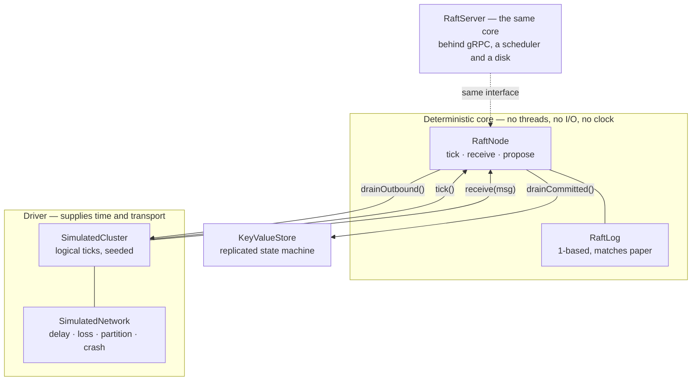
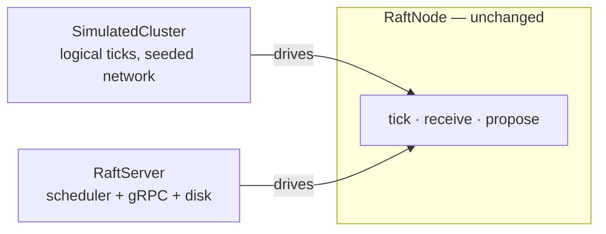

# Raft KV

[](https://github.com/Ankitnehra6/raft-kv/actions/workflows/ci.yml)
[](https://openjdk.org)
[](LICENSE)

An implementation of the [Raft consensus algorithm](https://raft.github.io/raft.pdf) and a
key-value store built on it — written from the start to be **deterministically
simulation-tested**.

A five-node cluster runs single-threaded inside a unit test. Partitions, packet loss,
message reordering and crashes are all inputs. There is not one `Thread.sleep` in the
suite. **155 tests run in about six seconds**, 147 of them in under one — including nine
seeds each driving 500 ticks of split-brain checking, and **linearizability verified** over
histories recorded under partitions, packet loss and leader crashes.

The same core also runs behind gRPC, so the algorithm that survives all that testing is the
one that actually serves requests.

> **Status: complete** for what it set out to be — consensus core, deterministic simulation
> harness, leader election, log replication, linearizability checking, a crash-safe durable
> log, snapshotting with compaction, single-server membership changes, and a gRPC surface
> with a real three-node cluster test. What remains are optimisations, listed under
> [Roadmap](#roadmap).

---

## Contents

- [Why simulation testing](#why-simulation-testing)
- [Architecture](#architecture)
- [Quickstart](#quickstart)
- [Linearizability](#linearizability)
- [Durability](#durability)
- [Snapshots](#snapshots)
- [Membership changes](#membership-changes)
- [Running it for real](#running-it-for-real)
- [What is verified](#what-is-verified)
- [Design decisions](#design-decisions)
- [Roadmap](#roadmap)

---

## Why simulation testing

Consensus bugs are almost never logic errors you can see by reading. They are bugs of
timing and ordering: a vote arriving after a term change, a response from a leadership
that has already ended, two nodes briefly both believing they lead. Those interleavings
happen rarely on a real network and essentially never on demand.

So the algorithm here has no threads, no sockets, no files and no wall clock.
[`RaftNode`](src/main/java/io/github/ankitnehra6/raftkv/core/RaftNode.java) accepts inputs
— `tick()`, `receive(message)`, `propose(command)` — mutates its state, and queues outputs
for a driver to collect. Everything that moves bytes lives outside it.

That buys three things a conventional test suite cannot have:

1. **Reproducibility.** A run is a pure function of its seed. "Fails about one time in
   fifty" becomes a fixed input someone can step through.
2. **Speed.** An hour of cluster behaviour costs a millisecond, so hostile scenarios can be
   run across many seeds on every commit rather than nightly.
3. **Faults on demand.** A partition is a method call, not an iptables rule.

```java
SimulatedCluster cluster = new SimulatedCluster(5, seed);
cluster.setDropRate(0.2);           // lose a fifth of all messages
cluster.setDelay(1, 6);             // variable delay, so messages reorder
cluster.tickUntilLeaderElected(500);

cluster.partition(List.of("n0", "n1"), List.of("n2", "n3", "n4"));
cluster.tick(300);
assertThat(cluster.node("n0").isLeader()).isFalse();   // a minority cannot lead
```

This is how FoundationDB and TigerBeetle test their consensus layers, and it is the reason
this implementation was written in this order: **the harness came before the algorithm.**

---

## Architecture



The dashed edge is the point, and it is not hypothetical: `RaftServer` drives the same
class over real sockets. The algorithm cannot tell the difference, which is what makes the
exhaustive simulation testing meaningful for what actually runs.

---

## Quickstart

```bash
./mvnw test
```

No Docker, no services, no configuration. 155 tests: the 147 simulation tests run in
under a second, and 8 integration tests start a real three-node cluster on real sockets.

```java
// Three nodes, seed 42
SimulatedCluster cluster = new SimulatedCluster(3, 42);
cluster.tickUntilLeaderElected(200);

RaftNode leader = cluster.leader().orElseThrow();
leader.propose(Command.encode(new Command.Put("city", "bengaluru")));
cluster.tick(50);

// Every replica now holds it
cluster.nodes().forEach(n ->
    assertThat(n.log().lastIndex()).isEqualTo(leader.log().lastIndex()));
```

---

## Linearizability

Asserting on logs and terms checks that the implementation matches the paper. It does not
answer the question a *user* has: could a client ever observe something a correct store
would not produce?

So the test driver records only what clients see — request sent, answer received, as an
interval — and a checker searches for a sequential ordering that explains every result
while respecting real-time order.

```
seed    3: total= 51 completed= 37 reads= 20 pending= 14 -> LINEARIZABLE
seed   17: total= 33 completed= 33 reads= 16 pending=  0 -> LINEARIZABLE
seed   42: total= 48 completed= 39 reads= 21 pending=  9 -> LINEARIZABLE
seed  128: total= 45 completed= 37 reads= 18 pending=  8 -> LINEARIZABLE
seed  999: total= 51 completed= 37 reads= 14 pending= 14 -> LINEARIZABLE
```

Those runs each survive twenty-five rounds of partitions, leader kills and 5% packet loss.

**Reads go through the log.** Serving a read from the leader's local state is faster and
wrong: a leader deposed without knowing it would answer from a stale state machine, and a
client would see a value that had already been overwritten. ReadIndex and leases are the
standard optimisations — both are refinements of this, and neither is worth adding before
a correct version exists to compare against.

**The checker is itself tested.** A checker that always answers "linearizable" would make
every other test pass while proving nothing, so five tests assert that it *rejects*
histories which are genuinely impossible:

| Impossible history | Test |
|---|---|
| A read returns a value nothing ever wrote | `rejectsAValueThatWasNeverWritten` |
| A read after a completed write sees the old value | `rejectsAStaleReadAfterACompletedWrite` |
| Two sequential reads go backwards in time | `rejectsReadsThatGoBackwardsInTime` |
| A deleted key is still readable | `rejectsAReadOfADeletedKey` |
| Two clients disagree about a settled value | `rejectsTwoClientsDisagreeingAboutASettledValue` |

Three details that make it sound rather than merely convenient:

- **Exceeding the search budget reports `UNKNOWN`, never success.** A checker that gives up
  and says "fine" converts an unproven claim into a false one.
- **Pending operations are kept.** A write whose response was lost may still have been
  applied, so the checker must be free to place it anywhere — or nowhere. Dropping them
  would produce false violations.
- **The tests refuse to pass vacuously.** `assertMeaningful` fails the run if it produced
  too few operations or too few completed reads, because reads are where a stale answer
  would show up.

---

## Durability

The log is append-only on disk, with every record length-prefixed and CRC-checked:

```
payloadLength (4) | term (8) | index (8) | commandLength (4) | command | crc32 (4)
```

`append` fsyncs before returning, because Raft counts a follower as having stored an entry
only once it acknowledges it — and a follower that acknowledges something still sitting in
a page cache can lose it in a power failure, after the leader has already told a client the
write succeeded.

Recovery assumes a crash can happen at any byte. A record half-written when the power went
out fails either its length check or its checksum, and recovery stops there, keeping every
record before it. That is safe precisely because such an entry was never acknowledged, so
no client was ever told it committed.

Tested by damaging the file directly and reopening it — waiting for a real power failure is
not a test strategy:

| Damage | Test |
|---|---|
| Trailing record cut short mid-write | `recoversFromATornTrailingRecord` |
| A bit flipped inside a record's payload | `detectsACorruptedRecordByChecksum` |
| A garbage length prefix claiming 2 GB | `rejectsAnImplausibleRecordLength` |
| Appending again after recovering from damage | `canAppendAfterRecoveringFromATornTail` |
| A truncated state file | `ignoresATruncatedStateFile` |

`currentTerm` and `votedFor` are persisted too, and via an atomic rename rather than an
in-place write. Losing either breaks *safety*, not just progress: a node that forgets its
term can accept a stale leader, and one that forgets its vote can vote twice in a term and
help elect a second leader. Both are written **before** the reply that depends on them
leaves — a node that answers a vote request and only then persists the vote can crash in
between and vote again in the same term.

### Restarts are modelled honestly

`SimulatedCluster.restart` rebuilds the `RaftNode` from its store rather than un-pausing
the object. Term, vote and log come back; role, commit index, leader and replication
progress do not — exactly as a process restart behaves. Keeping the in-memory node alive
and merely pausing it is the usual way these tests end up proving nothing.

| Guarantee | Test |
|---|---|
| A restarted node remembers its vote | `aRestartedNodeRemembersItsVote` |
| A restarted leader comes back a follower with commit index 0 | `aRestartedLeaderComesBackAsAFollower` |
| A restarted node recovers its log | `aRestartedNodeRecoversItsLog` |
| Committed data survives a whole-cluster outage, and the cluster re-elects | `committedDataSurvivesAWholeClusterRestart` |
| Stored state always matches the node's own view | `storedStateMatchesTheNodesView` |
| Clients still see a linearizable store across repeated restarts | `staysLinearizableAcrossRestarts` |

Truncation — which happens when a leader overwrites a follower's divergent suffix — rewrites
the file and moves it into place atomically. Slower than seeking, and far easier to reason
about: a crash mid-rewrite leaves either the whole old log or the whole new one, never a
spliced hybrid.

---

## Snapshots

Without compaction the log grows forever: a cluster up for a year keeps every write ever
made, a restarting node replays all of them, and a follower away for an hour is sent an
hour of history. A snapshot replaces that prefix with the state it produced.

The interesting case is not "a snapshot was taken" but **"a follower needed entries that no
longer exist"**. When a follower's `nextIndex` falls below the snapshot boundary there is
nothing left to replicate, so the leader sends `InstallSnapshot` instead — and the follower
discards its entire local log, because the leader's snapshot is authoritative and anything
beyond it was by definition never committed.

| Property | Test |
|---|---|
| Compaction actually shrinks the log | `compactionDiscardsTheLogPrefix` |
| The snapshot boundary still answers consistency checks | `theSnapshotBoundaryStillMatches` |
| A follower too far behind is caught up with state, not entries | `aFollowerTooFarBehindReceivesASnapshot` |
| A snapshot survives a restart, with no prefix to replay | `aSnapshotSurvivesARestart` |
| Compaction cannot run ahead of what was applied | `refusesToCompactPastWhatHasBeenApplied` |
| Restoring **replaces** state rather than merging it | `restoringReplacesRatherThanMerges` |
| The store stays linearizable while compacting | `staysLinearizableWhileCompacting` |

Three decisions worth naming:

- **The snapshot boundary keeps its term** even though the entry is gone. A follower one
  entry behind the boundary is the normal case, and the `AppendEntries` consistency check
  still has to be able to ask about that index.
- **The snapshot is written before the entries it replaces are dropped.** The reverse order
  has a window in which a crash leaves neither, which loses committed state outright.
- **Restoring clears the state machine first.** A snapshot is the complete state at its
  index; merging would keep a key the leader deleted while this node was away.
- **Compaction is driver-initiated.** Raft treats commands as opaque bytes, so it cannot
  serialise the state they produced — only the state machine's owner can.

---

## Membership changes

Membership lives **in the log**, not in a config file. A file could be edited on one machine
and not another, and the two would compute different majorities — which is precisely how a
cluster ends up with two leaders that each believe they have one.

Servers are added and removed **one at a time**. Arbitrary changes need joint consensus:
going from `{a,b,c}` to `{c,d,e}` in one step lets `{a,b}` and `{d,e}` form disjoint
majorities and elect two leaders. Changing by one keeps the old and new majorities
overlapping, so that cannot happen. A second change while one is in flight is refused —
the honest alternative to implementing joint consensus.

A configuration is adopted **the moment its entry is appended**, not when it commits (§4.1).
Waiting would leave a window in which some nodes count majorities under the old
configuration and some under the new one.

### A real bug this found

A membership test failed for a reason that had nothing to do with membership. The terms
told the story:

```
after  30 ticks: isLeader=true  term=1
after  60 ticks: isLeader=false term=3
after  90 ticks: isLeader=false term=6
after 120 ticks: isLeader=false term=8
after 150 ticks: isLeader=false term=10
```

A server had been provisioned but never added to the configuration. It never heard from the
leader, so it timed out and campaigned with an ever-higher term — and the "higher term means
step down" rule forced the legitimate leader to abdicate every time. The cluster churned
through elections making no progress.

This is §4.2.3 of the dissertation, and the fix is to **discard a vote request outright
while a leader is known to be healthy** — checked *before* the term rule, since refusing the
vote alone would not help. It is safe because a genuine leader failure stops the heartbeats
and the guard expires with them. Both directions are asserted:
`anOutsiderCannotDisruptAHealthyCluster` and `theGuardStillAllowsARealElection`.

---

## Running it for real

The same `RaftNode` that the simulation drives also runs behind gRPC. Nothing in the
algorithm changed to make that work — that is the point of the design.



`RaftServer` supplies the three things the core refuses to own:

- **Time** — a scheduler ticks the node every 50ms, so elections land between 500ms and 1s
- **Transport** — gRPC, with `RequestVote`, `AppendEntries` and `InstallSnapshot` mapped
  one-for-one onto the internal messages
- **Threading** — `RaftNode` is not thread-safe, so every touch happens on one event-loop
  thread. Outbound RPCs are dispatched off it, because blocking the loop on an unreachable
  peer would stop heartbeats to *every* peer and cause the very election the RPC was meant
  to prevent.

The wire schema is deliberately separate from the domain types. Serialising the domain
directly would make an ordinary refactor of the core a silent, breaking protocol change.

Clients get `Put`, `Get`, `Delete` and `Status`. A request to a non-leader returns
`ok=false` with a **leader hint** rather than an error — losing leadership is routine, and a
client that must parse an exception to find the leader will get it wrong.

The integration suite is deliberately small: it proves the driver works, and leaves fault
tolerance to the simulation, where a partition costs a method call instead of a real
timeout.

| Property | Test |
|---|---|
| Three real nodes elect one leader and all agree | `electsALeaderOverRealSockets` |
| Writes and reads work through the gRPC API | `writesAndReadsThroughTheApi` |
| A write reaches every replica's state machine | `writesReplicateToEveryNode` |
| A follower redirects with a leader hint | `aFollowerRedirectsRatherThanFailing` |
| The cluster keeps serving after losing a follower | `survivesLosingAFollower` |

---

## What is verified

Every item below is an assertion in the suite, not a description of intent.

### Election safety

| Property | Test |
|---|---|
| At most one leader per term, checked on **every tick** across 9 seeds | `neverTwoLeadersInTheSameTerm` |
| A minority partition can never elect a leader | `aMinorityPartitionCannotElectALeader` |
| The majority side elects one and makes progress | `theMajoritySideElectsALeaderDuringAPartition` |
| An isolated leader steps down when the partition heals | `anIsolatedLeaderStepsDownWhenThePartitionHeals` |
| A stable cluster does not churn through terms | `aLeaderKeepsLeadershipWhileHeartbeatsFlow` |
| Elections converge with 20% packet loss | `electsALeaderDespiteMessageLoss` |
| Elections converge with reordered messages | `electsALeaderDespiteReorderedMessages` |
| The same seed produces byte-identical history | `runsAreReproducible` |

### Log safety

| Property | Test |
|---|---|
| A minority leader cannot commit anything | `aMinorityLeaderCannotCommit` |
| A deposed leader's uncommitted write is **overwritten**, not merged | `aDivergentSuffixIsOverwrittenByTheNewLeader` |
| Logs agree at every committed index after arbitrary chaos, 5 seeds | `logsConvergeAfterHealing` |
| Every node applies the same sequence in the same order | `everyNodeAppliesTheSameSequence` |
| A rejoining follower catches up in a few round trips, not one per entry | `aRejoiningFollowerCatchesUp` |
| Replicas converge after repeated leader crashes, 5 seeds | `replicasConvergeAfterLeaderCrashes` |

---

## Design decisions

**The core is a pure state machine.** Discussed above; it is the decision every other one
follows from.

**Time is logical, not wall-clock.** `RaftConfig` is expressed in ticks. A tick is one
simulation step or a few real milliseconds — the algorithm neither knows nor cares. The
config constructor *rejects* a heartbeat interval at or above the minimum election timeout,
because that misconfiguration produces a cluster that re-elects forever and is miserable to
diagnose from the outside.

**Each node gets its own random stream**, derived from the cluster seed. Sharing one
generator would make a node's election timeout depend on how many draws its peers happened
to make first, so adding a node would perturb everyone's timing and no scenario would stay
reproducible across changes.

**A new leader appends a no-op** in its own term. §5.4.2 of the paper: a leader may not
commit an entry from an earlier term by counting replicas, because such an entry can still
be overwritten. Committing one entry of its own term commits the backlog by implication.

**`matchIndex` comes from the response**, not from what the leader sent. A reordered or
duplicated reply would otherwise advance it to the wrong place.

**Conflicts return a hint.** On a failed consistency check the follower names the first
index of the conflicting term, so the leader skips a whole divergent run in one round trip
instead of walking back one index per round trip. `aRejoiningFollowerCatchesUp` asserts the
difference.

**`appendFrom` truncates only on an actual conflict.** A delayed or duplicated
`AppendEntries` legitimately carries entries the follower already has; truncating blindly
would discard entries it has already acknowledged.

**`SimulatedCluster.leader()` returns empty when there are several.** During a partition
two nodes can both believe they lead, and returning one arbitrarily would hide exactly the
situation worth noticing.

---

## Roadmap

Built:

- [x] Deterministic simulation harness — logical clock, seeded network, partitions, loss,
      reordering, crashes
- [x] Leader election with randomised timeouts and the §5.4.1 up-to-date restriction
- [x] Log replication, commit advancement, conflict hints
- [x] Replicated key-value state machine with length-prefixed command encoding
- [x] **Linearizability checking** — Wing & Gong search, partitioned per key, memoised,
      budget-bounded; and the checker is itself tested against impossible histories
- [x] Linearizable reads, routed through the log
- [x] **Crash-safe durable log** — CRC-checked records, fsync before acknowledgement,
      recovery from torn writes, atomically-persisted term and vote
- [x] **Durable log wired into the node** — term and vote persisted before the reply that
      depends on them; restarts rebuild from storage
- [x] **Snapshotting and log compaction**, including `InstallSnapshot` for followers whose
      entries have been compacted away
- [x] **Single-server membership changes**, with the §4.2.3 guard against servers outside
      the configuration disrupting it
- [x] **gRPC surface** — a real three-node cluster, with the same core the simulation drives
- [x] 155 tests across election safety, log safety, convergence, linearizability, crash
      recovery, compaction, membership and a real network

Next, in order:

- [ ] **gRPC surface** — a real client API and a real network driver, which the pure core
      is already shaped to accept
- [ ] Follower reads with lease-based consistency, as a measured optimisation over the
      current log-routed reads

Two things a reader should know before judging this as production software: it has never
run outside a test, and the throughput optimisations above are all absent. What it is, is a
correct implementation of the algorithm with the evidence to back that claim.

---

## License

MIT — see [LICENSE](LICENSE).
